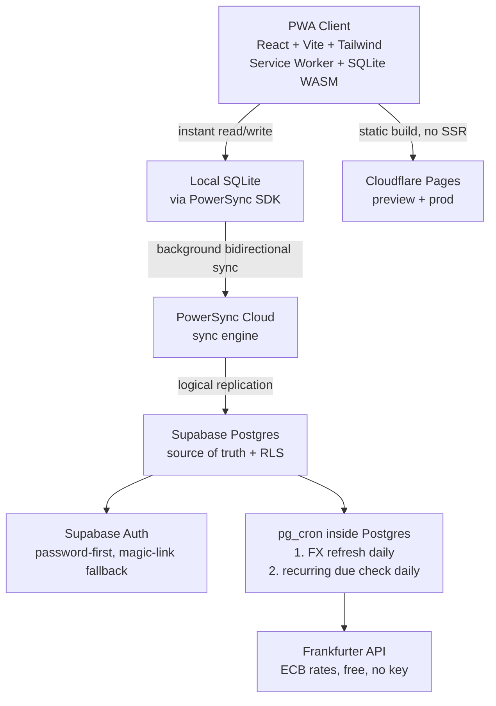
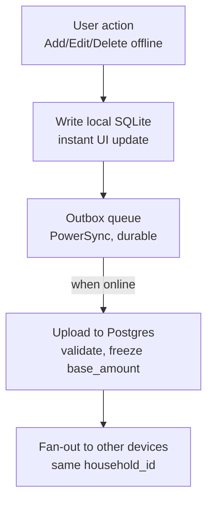
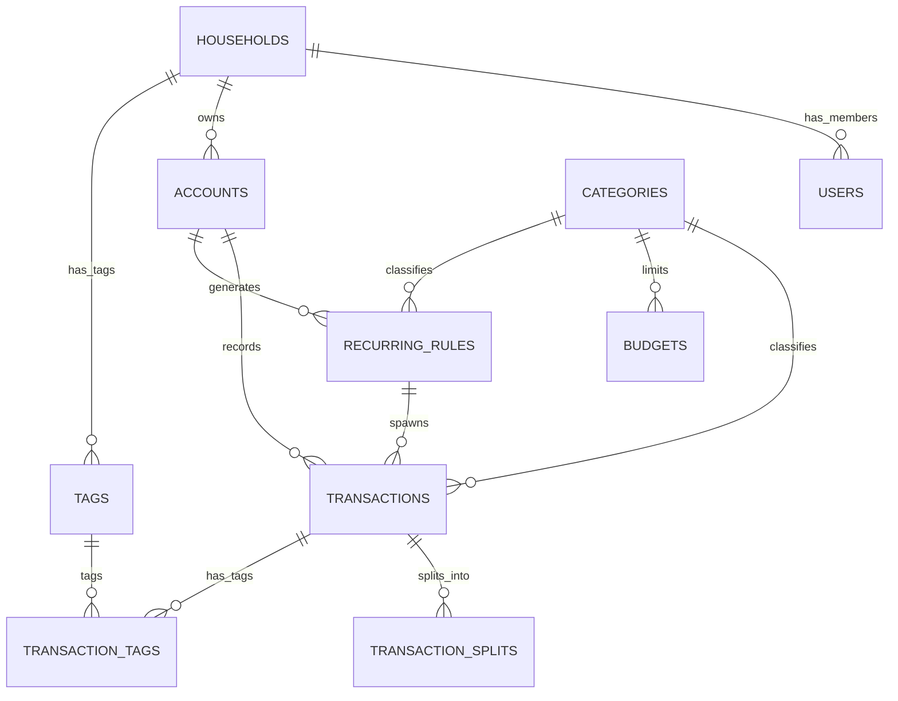
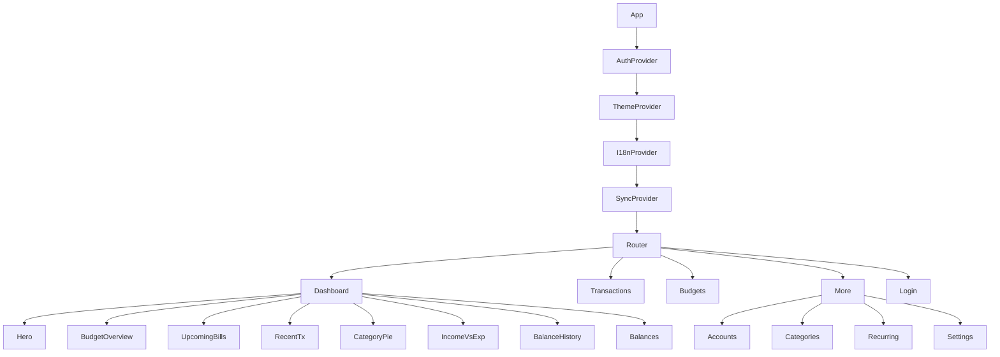

# Architecture — Personal Expense Tracker PWA

Source of truth for scope: `expense-app-context.md`.
Decisions locked: en + es-MX from day one (i18n), Cloudflare Pages hosting,
Supabase Auth password-first with magic-link fallback (ADR-007 revised),
in-app Upcoming Bills (no push v1), `base_amount` frozen forever.

## 1. System architecture



Rules:

- Frontend talks only to PowerSync for data. Only PowerSync talks to Postgres.
- Static build, no SSR. All queries that can run locally run locally.
- `pg_cron` + Edge-adjacent SQL is the only server compute (no extra host).

## 2. Offline write and sync flow



- UI never blocks on network. Sync is background.
- Conflict strategy v1: last-write-wins. Flagged for revisit if household >1 user writes concurrently.

## 3. Data model (v1)



Tables (Postgres = source of truth, SQLite mirrors subset).
Migrations live in `supabase/migrations/0001`–`0009`:

- `households(id uuid pk, name text)` — everything hangs off this, even single-user v1.
- `users(id uuid pk -> auth.users, email, base_currency MXN|USD, household_id fk, locale en|es-MX)`.
- `accounts(id, household_id fk, name, type: bank|cash|credit|digital_wallet|investment)`.
- `categories(id, key nullable unique, kind, sort, household_id nullable fk, label nullable)` —
  global catalog rows (`household_id NULL` + `key`, localized client-side via
  `categories.<key>`); custom rows (household + `label`, `key NULL`). Seed: 12 keys (0002).
- `transactions(id, household_id fk, account_id fk, category_id fk, amount numeric, currency MXN|USD, base_amount numeric FROZEN, txn_date date, kind, note nullable, recurring_rule_id nullable fk, created_at)`.
- `transaction_splits(id, transaction_id fk, category_id fk, amount)` — sum(splits) == amount, always persisted (single whole-amount row when not split).
- `tags(id, household_id fk, name)` + `transaction_tags(id uuid pk, transaction_id fk, tag_id fk, unique pair)` — surrogate `id` required by PowerSync (0008).
- `budgets(id, household_id fk, category_id fk, limit_amount, period, unique(household, category, period))` — reset each period, no rollover.
- `recurring_rules(id, household_id fk, account_id fk, category_id fk, amount, currency, cadence, next_due, note nullable, is_active)` — never pre-creates future rows.
- `exchange_rates(id uuid pk, base_currency, target_currency, rate, rate_date, unique triple)` — daily Frankfurter cache, both directions; never updated historically (0008 changed serial id to uuid for sync).

Sync Streams (`powersync/sync-config.yaml`, household scope + global catalogs):
streams must use `IN (SELECT …)` — the validator rejects scalar `= (SELECT …)`.

Invariants:

1. `base_amount` computed once at creation with rate on `txn_date`, never recomputed on read or on base-currency switch.
2. Recurring job: daily check `next_due <= today` → insert `transactions` → advance `next_due` (+7d / +1mo with month-end clamp / +1y). Cancelling a rule deletes zero future rows.
3. Balances and reports always aggregate `base_amount` signed by `kind`, never live FX.

## 4. Component structure



Routes: `/` (home), `/transactions`, `/transactions/new`, `/transactions/:id/edit`,
`/accounts`, `/categories`, `/budgets`, `/recurring`, `/more`, `/settings`,
`/login` (+ 404). `/reports` redirects to `/`.

Folders:

```text
src/
  app/         # router
  auth/        # AuthProvider + useAuth (session, magic link, password)
  components/  # Layout, Page, icons, pickers, BudgetBar/Progress, UpcomingBills
  data/        # reactive hooks + mutations per entity (accounts, budgets,
               # categories, household, periods, recurring, reports, tags,
               # transactions) + types
  i18n/        # I18nProvider + useI18n + locales/en.json, es-MX.json
  lib/         # supabase client, prefs, fx (frozen conversion), format
  pages/       # Dashboard, Transactions, TransactionForm, Accounts, Categories,
               # Budgets, Recurring, More, Settings, Login, NotFound
  powersync/   # AppSchema, db singleton, SupabaseConnector
  sync/        # SyncProvider + useSync (online/engine/connected/hasSynced/syncError)
  theme/       # ThemeProvider + useTheme (system/light/dark)
supabase/migrations/  # 0001-0009, numeric apply order
powersync/            # sync-config.yaml (Streams, mirrors RLS)
scripts/              # check-supabase.mjs, gen-pwa-icons.mjs
```

## 5. PWA requirements (must-pass per release)

1. `<meta name="viewport" content="width=device-width, initial-scale=1, viewport-fit=cover">`.
2. `100dvh`, never `100vh`.
3. `env(safe-area-inset-*)` padding on root + fixed bars (0 on Windows, correct on Android).
4. `manifest.json`: `display:standalone`, `theme_color/background_color` = app bg, maskable 192 + 512 with art inside 80% safe zone (verify maskable.app).
5. `vite-plugin-pwa` Workbox service worker, offline shell.
6. Lighthouse PWA audit green. Targets: Windows Chrome/Edge, Android Chrome Pixel 9 Pro XL.

## 6. i18n (en + es-MX day one)

- `src/locales/en.json`, `es-MX.json`, user `locale` in settings + stored on `users`.
- Seed categories bilingual; currency display disambiguates `MX$` vs `US$`; dates via `Intl.DateTimeFormat(locale)`.
- No hardcoded UI strings outside locales.

## 7. Cost model

| Service | Free tier | Expected | Cost |
|---|---|---|---|
| Supabase | 500 MB, 50k MAU | few MB | $0 |
| PowerSync | 2 GB synced/mo | 1–3 users | $0 |
| Cloudflare Pages | generous static | low traffic | $0 |
| Frankfurter | free unlimited | daily | $0 |

Note: Supabase free pauses after 7d inactivity — resume from dashboard; non-issue with weekly use.
