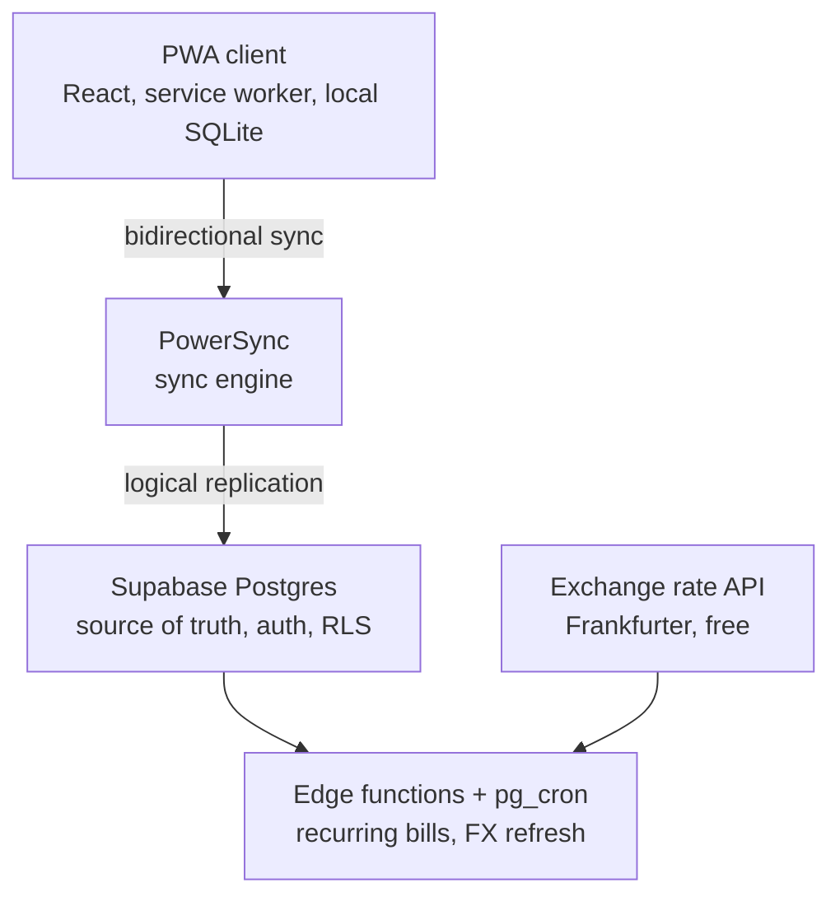
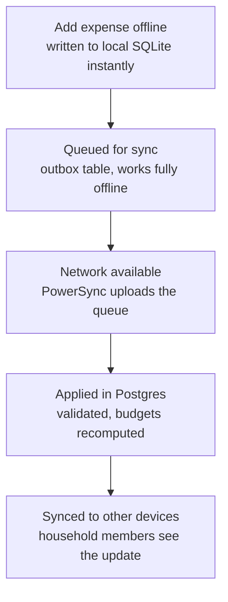
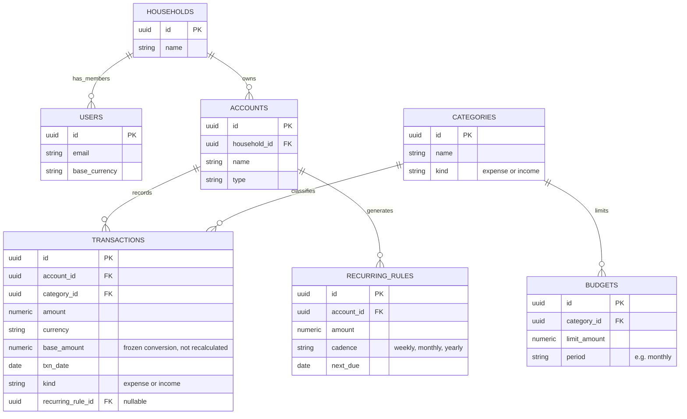

# Personal expense tracker — application context

This document is the full context for building the application. Read it before writing any code. It covers scope, architecture, data model, sync behavior, and PWA requirements. Where a decision has already been made, treat it as fixed unless it conflicts with something technically impossible; flag conflicts instead of silently changing the decision.

## 1. Purpose

A personal finance app to track expenses (primary) and income (secondary), see spending against budgets, track recurring bills, and support multiple currencies. Built as a Progressive Web App (PWA) so it installs and runs on both Windows (desktop) and Android (phone), including full offline use.

## 2. Users

- Initial state: single user, no shared data.
- Required from day one in the data model (not necessarily in the UI): a household can contain more than one user, and expenses/accounts belong to a household, not directly to a user. This lets a second user join later without a schema change.

## 3. Functional requirements

- Add, edit, delete expense and income transactions.
- Each transaction: amount, currency, category, account, date, optional note.
- Budgets: a spending limit per category per period (e.g. monthly).
- Recurring bills: a rule that auto-generates a transaction on a schedule (weekly, monthly, yearly), without pre-creating future transactions.
- Multi-currency: each transaction keeps its original currency and a fixed conversion to the user's base currency, calculated at the time the transaction is created (never recalculated retroactively).
- Reports: totals and breakdowns by month and by category, computed from stored data (no external reporting service).
- Not in scope for v1: receipt photo attachments, bank statement import.

## 4. Non-functional requirements

- **Offline-first**: the app must be fully usable with no network connection. Reads and writes happen against a local database on the device; sync to the server happens in the background when connectivity returns. The UI must never block on a network call.
- **Hosting budget**: $5–15/month target. The chosen stack should run at $0/month at this usage scale, with that budget as headroom.
- **Installable PWA**: must install cleanly on Windows (desktop browser) and Android (Chrome, tested specifically against a Pixel 9 Pro XL), with no layout cutoff, no overlap with the Android gesture bar or camera cutout, and no white/black flash on launch.

## 5. Technology decisions

| Layer | Technology | Reason |
|---|---|---|
| Frontend framework | React + Vite | Standard, fast dev loop, wide ecosystem |
| Local/offline database | SQLite via PowerSync's client SDK (WASM in the browser) | Real SQL locally, not a document store; needed for budget/report queries that join across tables |
| Sync engine | PowerSync | Purpose-built for offline-first apps: streams Postgres changes to the client and queues local writes for upload; free tier (2 GB synced/month) covers this app's scale |
| Backend database | Supabase (managed Postgres) | Relational, includes Auth and Row Level Security for the future multi-user household model; free tier (500 MB db, 50k MAU) covers this app indefinitely at personal scale |
| Auth | Supabase Auth | Bundled with the database choice, no separate service |
| Scheduled jobs (recurring bills, FX refresh) | Postgres `pg_cron`, included free on Supabase | Runs inside the database, no extra hosting piece |
| Exchange rates | Frankfurter API (ECB data, free, no API key) | Fetched daily by a scheduled job, cached in a table |
| Frontend hosting | Cloudflare Pages, Vercel, or Netlify (any, free tier) | Static PWA hosting, no server-side rendering needed |
| PWA tooling | `vite-plugin-pwa` (built on Workbox) | Generates manifest.json and service worker from Vite config |
| Icon tooling | maskable.app (manual, one-time use) | Verifies maskable icon safe zones for Android launcher cropping |
| PWA audit | Lighthouse (Chrome DevTools) | Run before each release to catch manifest/service worker issues |

Do not substitute Firestore, MongoDB, or another NoSQL store for the backend database. The relational model is required for budget and recurring-rule logic (see section 7).

## 6. System architecture

The frontend is a static build (no server-side rendering) deployed to any static host. It talks only to PowerSync for data; PowerSync is the only component that talks to Postgres directly.

## 7. Offline write and sync flow

Key rule: the UI writes to local SQLite and updates instantly, regardless of connectivity. Sync to Postgres is always a background concern, never a blocking one.

## 8. Data model

### Rules that govern this schema

- **`base_amount` is frozen at creation time.** It is calculated once, using the exchange rate on the transaction's date, and never recalculated when rates change later. Historical reports must stay stable. Do not write logic that recomputes `base_amount` on read.
- **Recurring rules do not pre-generate future transactions.** A daily scheduled job checks `recurring_rules.next_due`, and only creates the actual `transactions` row on the day it is due, then advances `next_due`. This means cancelling a rule never requires deleting future rows, because none exist yet.
- **`households` sits above everything.** Even in the single-user v1, every account and transaction belongs to a household, not directly to a user, so a second user can be added later without migrating existing data.

## 9. PWA requirements (fit and feel on Android and Windows)

These are required, not optional polish:

1. Viewport meta must include `viewport-fit=cover`:
   `<meta name="viewport" content="width=device-width, initial-scale=1, viewport-fit=cover">`
2. Use `100dvh`, never `100vh`, for any full-height container. `100vh` on Android Chrome includes space behind the address bar and causes visible cutoff.
3. Apply `env(safe-area-inset-top)`, `env(safe-area-inset-bottom)`, `env(safe-area-inset-left)`, `env(safe-area-inset-right)` as padding on the root layout and on any fixed top/bottom bar. This is required so content does not sit under the camera cutout or behind the Android gesture bar. These values are `0` on Windows, so the same CSS is safe on both platforms without a platform check.
4. `manifest.json` must define icons with `"purpose": "maskable"` at 192x192 and 512x512, with the actual artwork kept inside the inner 80% safe zone (verify with maskable.app before shipping).
5. `manifest.json` must set `"display": "standalone"`, and `theme_color` / `background_color` must match the app's actual background color to avoid a flash on launch.
6. Every release must pass a Lighthouse PWA audit before deployment.

## 10. Cost model at expected usage

| Service | Free tier limit | Expected usage | Cost |
|---|---|---|---|
| Supabase | 500 MB db, 50k MAU | A few MB of transaction history | $0 |
| PowerSync | 2 GB synced/month, 50 connections | 1–3 users | $0 |
| Static hosting | Generous free tier | Low traffic | $0 |
| Frankfurter API | Free, unlimited | Daily refresh | $0 |

Note: Supabase's free tier pauses a project after 7 days of no activity; it resumes manually from the dashboard. Not a concern if the app is used at least weekly.

## 11. Explicitly out of scope for v1

- Receipt photo attachments
- Bank statement import (CSV/OFX)
- Native mobile app (iOS/Android store builds) — PWA only
- Multi-household support beyond the one household a user belongs to

## 12. Decisions (answers to open questions)

### Default categories (seeded on first run)

**Expense categories:**
- Food & Dining
- Transportation
- Housing
- Utilities
- Entertainment
- Health & Fitness
- Education
- Shopping
- Other Expense

**Income categories:**
- Salary
- Freelance
- Other Income

### Budget behavior

Budgets **reset each period** (no rollover). Unused amounts do not carry over to the next month/week/year.

### Recurring rule notifications

Notify the user **before** generating the transaction (alert a day before).

## 13. Additional user decisions

### Base currency

User chooses between **MXN** and **USD** at setup. This is the base currency for reports and conversions.

### Account types

Support all of the following:
- Bank accounts (checking, savings)
- Cash
- Credit cards
- Digital wallets (PayPal, Venmo, etc.)
- Investment accounts

### Dark mode

**System + manual override**: Follow system theme by default, but allow user to manually toggle between light/dark.

### Dashboard elements

Show all of the following on main dashboard:
- Budget overview (current month's spending vs budget)
- Recent transactions list
- Category breakdown (pie chart)
- Income vs expenses trend
- Upcoming bills
- Account balances

### Reports

- Monthly totals and trends
- Category spending breakdown
- Budget vs actual comparison
- Account balance history
- Custom date range reports

### Transaction splitting

**Allow splitting** a single transaction across multiple categories.

### Tags/labels

**Optional tags** for additional filtering beyond categories.

### Search and filtering

- Text search (by note)
- Date range filter
- Category filter
- Account filter

### Data export

**Not for v1** - will be added in future version.
